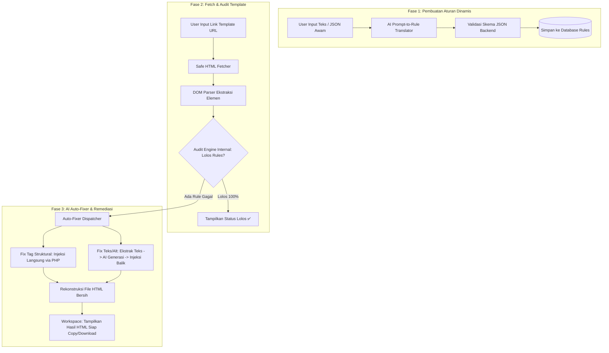

# 📄 Dokumen Konteks & Rencana Implementasi: AI-Powered SEO Rule Builder & HTML Auto-Remediation

Dokumen ini merangkum seluruh hasil diskusi, analisis kebutuhan klien, rancangan arsitektur sistem, estimasi biaya API, hingga panduan implementasi teknis untuk pengembangan fitur baru pada proyek **SEO-HTML-Checker**.

Dokumen ini disiapkan agar AI Agent (Antigravity) atau developer dapat langsung memahami seluruh konteks dan melanjutkan pengerjaan tanpa kehilangan detail penting.

---

## 1. 📌 Ringkasan Proyek & Profil Klien

* **Nama Proyek:** `SEO-HTML-Checker` (Laravel, PHP 8.4)
* **Klien:** Client Fastwork (User awam / non-programmer yang aktif menggunakan prompt LLM)
* **Kebutuhan Utama Klien:**
  1. Menambahkan aturan audit SEO baru secara fleksibel tanpa menyentuh kodingan (*"gonta-ganti rules tanpa batas"*).
  2. Sistem bisa mengambil file HTML langsung melalui **link template** yang diinputkan.
  3. Sistem mengaudit template terhadap aturan SEO, dan jika **belum lolos**, AI dapat **memperbaiki kode HTML secara otomatis** (misal: menambahkan tag `alternate`, `alt` pada ``, atau menyelaraskan konten teks utama).
  4. Output akhir berupa **kode HTML baru yang sudah bersih & lolos audit** untuk disalin (*copy-paste*) oleh klien.
* **Kekhawatiran Terbesar Klien:** Biaya API AI membengkak / boros token (*"Tapi takutku malah boros"*).
* **Budget Klien:** Rp 350.000 / bulan untuk pembuatan / audit sekitar 10 Landing Page (LP) per hari (300 LP / bulan).

---

## 2. 🧠 Memahami Inti Masalah & Solusi Arsitektur

### Masalah 1: User Ingin Bikin Rules Dinamis tetapi Formatnya Berantakan
* **Kondisi:** Klien mengetik aturan dalam bahasa sehari-hari atau menempelkan contoh JSON hasil kreasi ChatGPT yang belum tentu cocok dengan struktur *rule engine* sistem kita.
* **Solusi (AI Rule Translator):** 
  AI bertindak sebagai **"Compiler / Penerjemah"**. AI membaca perintah teks bebas dari user, lalu menerjemahkannya ke dalam **format JSON baku sistem** yang sudah kita tentukan. Setelah tervalidasi, JSON tersebut disimpan ke database sebagai *Active Rule*.

### Masalah 2: Klien Ingin AI Memperbaiki HTML Tanpa Merusak Desain
Contoh JSON instruksi dari klien:
```json
{
  "content_replacement": {
    "action": "replace_content",
    "scope": "all_templates",
    "source_of_truth": ["title", "meta_description"],
    "instruction": "Ganti dan sesuaikan seluruh konten utama template berdasarkan topik, konteks, keyword, judul, dan meta description...",
    "apply_to": ["main_content", "long_description", "visible_text"],
    "preserve": [
      "title", "meta_description", "html_structure", "layout",
      "css", "javascript", "urls", "href", "src", "canonical", "amphtml", "tracking_code"
    ],
    "rules": {
      "match_title_context": true,
      "do_not_modify_layout": true,
      "do_not_break_template": true
    }
  }
}
```
* **Kondisi:** Jika seluruh kode HTML mentah (beserta CSS, JS, dan tag wrapper) dikirim langsung ke LLM untuk ditulis ulang, maka:
  1. Token akan sangat boros (puluhan ribu token per halaman).
  2. AI rawan memotong kode, menghilangkan script tracking, atau merusak class CSS.
* **Solusi (Hybrid DOM Extraction & Targeted Remediation):**
  1. **Tag Struktural (0 Token):** Kekurangan tag seperti `<link rel="alternate">`, `<meta>`, atau kanonikal diperbaiki langsung oleh backend PHP via DOM Parser (tanpa memanggil AI).
  2. **Konten Teks & Atribut (Hemat Token):** Backend PHP hanya menyedot node teks (`visible_text`) atau gambar tanpa `alt`. Hanya teks tersebut yang dikirim ke AI untuk ditulis ulang atau diberi deskripsi.
  3. **Rekonstruksi (Re-injection):** Hasil teks dari AI dimasukkan kembali ke node DOM HTML template asli oleh PHP. Struktur HTML, class CSS, JS, dan URL dipastikan 100% aman dan tidak rusak.

---

## 3. 🏗️ Alur Kerja Sistem (System Workflow)



---

## 4. 💰 Hasil Riset Resmi & Estimasi Biaya API OpenAI

Berdasarkan dokumentasi resmi terbaru OpenAI (`developers.openai.com/api/docs/pricing`):

### A. Daftar Harga Resmi per 1 Juta Token (1M Tokens)
* **GPT-5 Nano:** Input `$0.05` | Output `$0.40`
* **GPT-4o-mini:** Input `$0.15` | Output `$0.60`
* **GPT-5 Mini:** Input `$0.25` | Output `$2.00`
* **GPT-5 Full (Flagship):** Input `$1.25` | Output `$10.00` (8x-20x lipat lebih mahal)

### B. Pembuktian Hitungan Riil per 1 Landing Page (LP)
Asumsi pemakaian 1 LP: Input ~3.000 token (teks instruksi + konten asli), Output ~2.000 token (hasil teks perbaikan). Kurs acuan: $1 = Rp 15.500.

| Model AI | Biaya Input (3k) | Biaya Output (2k) | Total per 1 LP | Total 300 LP (1 Bulan) |
| :--- | :--- | :--- | :--- | :--- |
| **GPT-5 Nano** | Rp 2,33 | Rp 12,40 | **Rp 14,73 perak** | **~Rp 4.500 / bulan** |
| **GPT-4o-mini** | Rp 6,98 | Rp 18,60 | **Rp 25,58 perak** | **~Rp 7.800 / bulan** |
| **GPT-5 Mini** | Rp 11,63 | Rp 62,00 | **Rp 73,63 perak** | **~Rp 22.000 / bulan** |
| **GPT-5 Full** | Rp 58,13 | Rp 310,00 | **Rp 368,13 perak** | **~Rp 110.000 / bulan** |

### C. Kesimpulan untuk Budget Klien (Rp 350.000 / Bulan):
* Jika memakai **GPT-4o-mini** atau **GPT-5 Nano/Mini**, penggunaan 10 LP/hari hanya menghabiskan **Rp 7.000 – Rp 25.000 per bulan**.
* Budget klien tersisa lebih dari **90%**, membuktikan bahwa arsitektur yang dirancang sangat hemat dan tidak akan membuat klien boncos.
* Seluruh biaya bersifat **All-in Pay-as-you-go** (tidak ada biaya bulanan atau biaya klik tersembunyi dari OpenAI).

---

## 5. 🛠️ Rencana Fitur & Tugas Implementasi (Task Breakdown)

### Task 1: AI Prompt-to-Rule Translator
* Buat *Service* untuk mengubah deskripsi bahasa manusia menjadi schema JSON aturan SEO yang valid.
* Definisikan schema JSON standar untuk aturan SEO (tipe aturan: tag presence, attribute presence, text length, regex pattern, context matching).
* Sediakan antarmuka validasi menggunakan Laravel Validation / JSON Schema.

### Task 2: Template URL Fetcher & DOM Parser
* Buat endpoint/fitur input URL template web.
* Terapkan proteksi SSRF, timeout handling, serta User-Agent impersonation saat mengambil HTML.
* Parse dokumen HTML menggunakan `DOMDocument` / `Symfony DomCrawler`.

### Task 3: Audit Engine & Auto-Fixer Service
* **Modul Pengecekan:** Jalankan evaluasi rule terhadap DOM template.
* **Modul Perbaikan Otomatis:**
  * Tag yang hilang (`<link rel="alternate">`, meta tags): Tambahkan langsung ke `<head>`.
  * Atribut yang hilang (`alt` gambar): Buat deskripsi berbasis konteks halaman dan pasang ke node ``.
  * Penyelarasan konten: Ganti teks paragraf utama dengan teks baru hasil AI yang selaras dengan Title & Meta Description tanpa mengubah class CSS/tag pembungkus.

### Task 4: UI/UX Workspace
* Form input Link Template & pilihan Active Rules.
* Hasil audit sebelum & sesudah remediasi.
* Code viewer dengan fitur **Copy to Clipboard** dan tombol **Download .html**.

---

*File ini dibuat otomatis sebagai panduan kerja komprehensif bagi sesi pengembangan sistem.*
